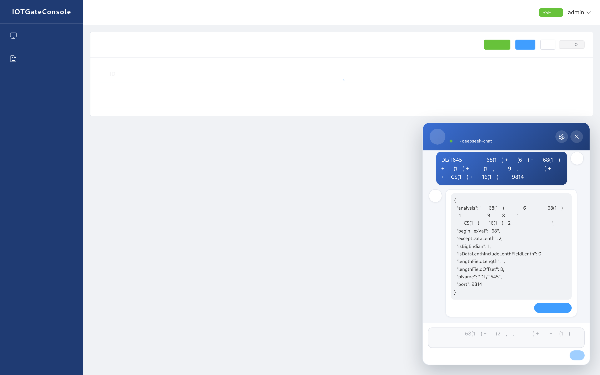
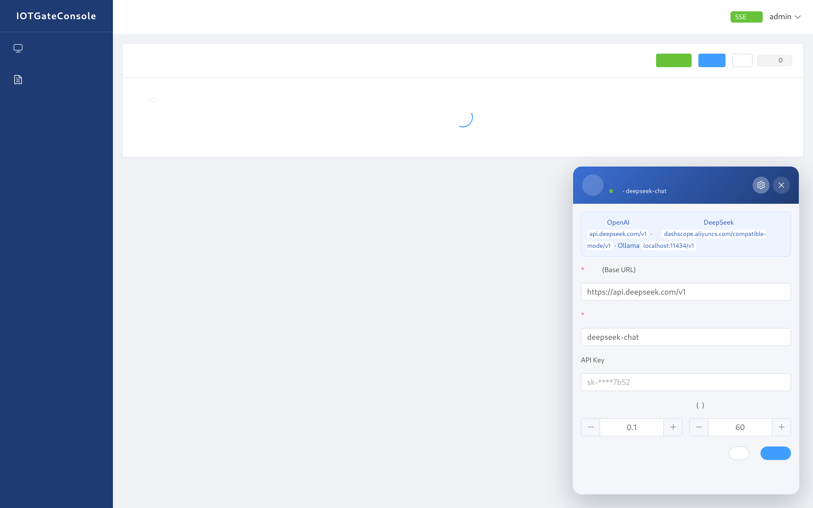
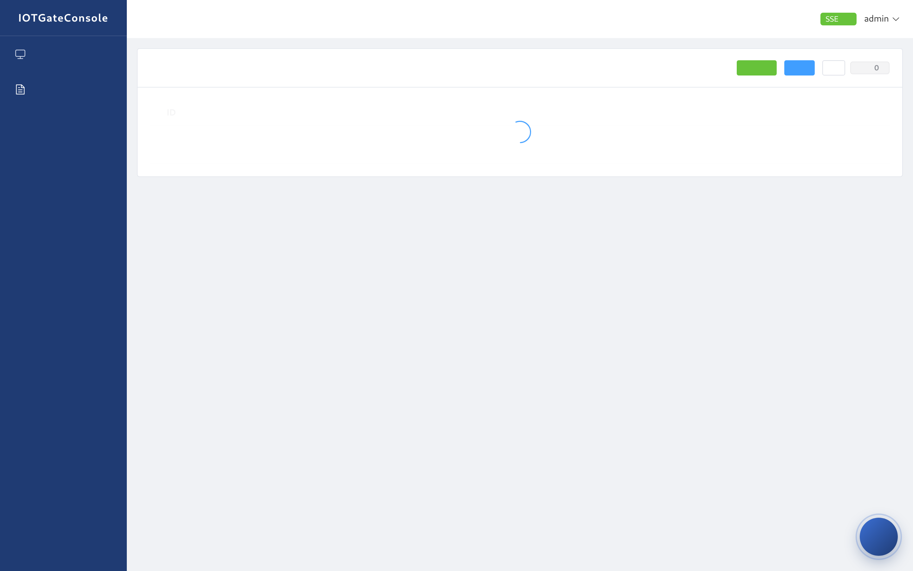

# IOTGateConsole

### 介绍
IOTGateConsole是IOTGate智能网关的控制台程序，用于查看当前IOTGate CLUSTER的运行状态，执行 网关规约解析服务的启动、关闭、重启以及网关多规约策略配置等操作

### 架构变更说明（v2.0）
本版本对架构做了两项重要调整：

1. **去除 Zookeeper 依赖**：网关节点发现不再依赖 ZK 注册中心，改为在 `application.properties` 中通过 `gate.nodes` 静态配置网关节点 IP 列表（支持 `ip` 或 `ip:port` 格式，默认 RPC 端口 10916）。
2. **前端 Vue3 重构 + SSE 实时推送**：原 LayUI/jQuery 静态页面已重构为 Vue3 + Vite 单页应用；前端通过 SSE（`GET /rpc/events`）实时接收网关节点上下线状态、规约变更事件，替代原 ZK 事件监听机制。

### 智能体模式（v2.2 悬浮机器人）

控制台内置 **🤖 悬浮智能体机器人**（右下角，主流客服交互设计），集**对话解析**与**大模型配置管理**于一体：

**🗣️ 对话解析**：粘贴通信协议的**帧结构描述**（协议文档中的字段定义：帧头、各字段字节数、**长度域位置与定义**、字节序、校验帧尾等），AI 自动提取长度域信息，推导出网关拆包/黏包解码参数（大小端/起始符/长度域偏移/长度域长度/长度含长度域标志/额外长度/端口），并支持**一键填充**到新增规约表单：

**⚙️ 大模型配置动态设置**：**厂商无关**，支持任意 OpenAI 兼容接口（DeepSeek / 通义千问 / 智谱GLM / Ollama / OpenAI 等）。点击机器人右上角 ⚙️ 可视化修改模型地址、模型名称、API Key、采样温度、超时时间，**保存立即生效，无需重启**，配置持久化本地（重启后保留）：

技术栈：**LangChain4j 1.18**（AiServices 声明式结构化输出，Java 8 老项目平滑升级至 **JDK 21 + Spring Boot 3.5**）

- 后端接口：
  - `POST /rpc/ai/parse` 解析帧结构描述
  - `GET /rpc/ai/config` 获取大模型配置（API Key 脱敏返回）
  - `POST /rpc/ai/config` 动态更新大模型配置（即时生效）
- 默认配置（application.properties / 环境变量，运行时可在前端 ⚙️ 设置中覆盖）：
  - `ai.api-key=${DEEPSEEK_API_KEY:}` 建议环境变量注入，勿硬编码提交
  - `ai.base-url=https://api.deepseek.com/v1` 兼容端点
  - `ai.model=deepseek-chat`
  - `ai.temperature=0.1` / `ai.timeout-seconds=60`
- 常见模型切换示例：
  - DeepSeek：`https://api.deepseek.com/v1` + `deepseek-chat`
  - 通义千问：`https://dashscope.aliyuncs.com/compatible-mode/v1` + `qwen-plus`
  - 智谱GLM：`https://open.bigmodel.cn/api/paas/v4` + `glm-4`
  - Ollama 本地：`http://localhost:11434/v1` + 本地模型名（无需 Key）

### 环境要求
jdk21（Temurin 21 LTS 及以上）、mysql5.5+ 以及 IOTGate 节点

### 运行方式
1. 搭建 mysql 服务并导入 `src/main/resources/strategy.sql` 建表
2. 在 `src/main/resources/application.properties` 中配置数据库参数和 `gate.nodes` 网关节点列表
3. 执行 `mvn package` 打成可执行 jar 包，启动 jar 包，默认端口为 8686
4. 访问 http://127.0.0.1:8686/static/index.html ，首次访问会跳转到登录页，用户名密码随意填写（没有存库！）
5. 前端源码位于 `frontend/` 目录（Vue3 + Vite），如需二次开发：`cd frontend && npm install && npm run dev`（开发模式代理 /rpc 到 8686）；构建产物已集成到 `src/main/resources/static/`

### GATE CLUSTER 结构图

GATE Console 是一个web工程，用户登录之后可以查看当前GATE CLUSTER的运行状态监控，执行网关重启、关闭、启动，网关多规约支持策略等操作（目前不考虑监控网关服务器状态功能）

### 入口类

	IotGateConsoleApplication

### 接口说明
- `POST /rpc/gateData` 获取所有网关节点信息(含运行规约)
- `POST /rpc/addOneStrategy` 新增规约(表单格式 data[pid]=xx&data[straName]=xx...)
- `POST /rpc/getAllStrategeFromDB` 获取所有规约名称与编号
- `POST /rpc/getAllStrategyAllInfo` 获取所有规约完整信息
- `POST /rpc/updateStrategyNode` 更新网关节点启用的规约
- `POST /rpc/delOneStrategyByPID` 删除规约(str=pid)
- `POST /rpc/ai/parse` 智能体解析帧结构描述
- `GET /rpc/ai/config` 获取大模型配置(Key脱敏)
- `POST /rpc/ai/config` 动态更新大模型配置(即时生效)
- `GET /rpc/events` SSE 事件流(节点状态/规约变更实时推送)

### 交流群
- QQ群：844082385
