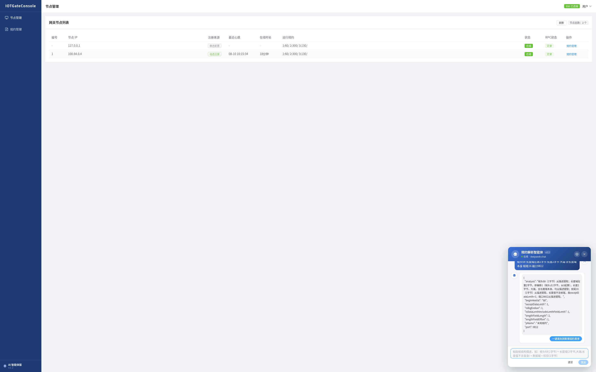
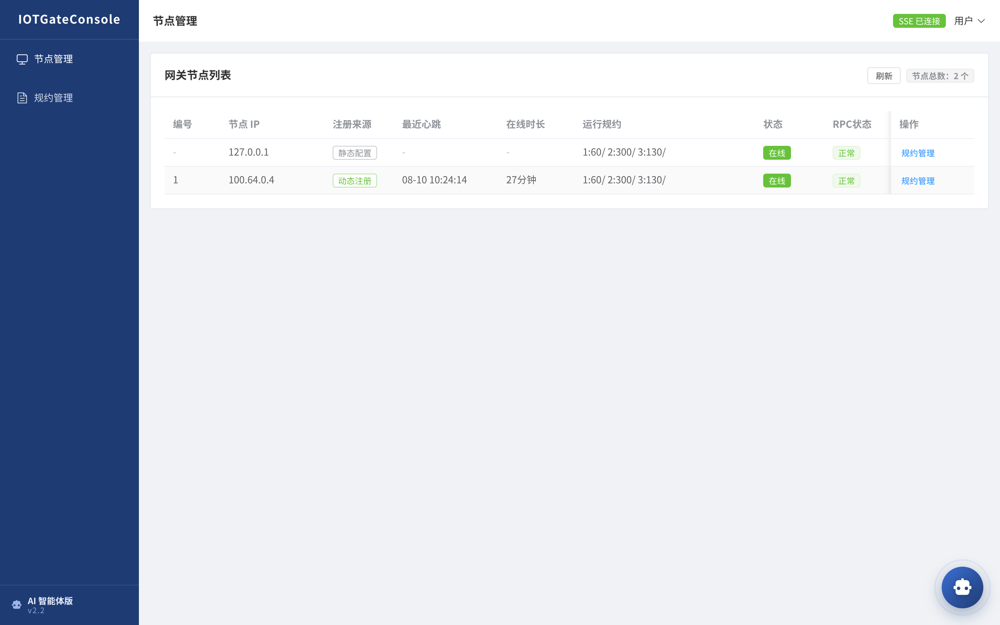
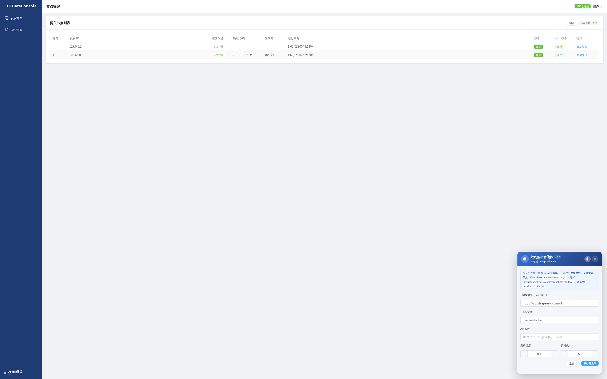
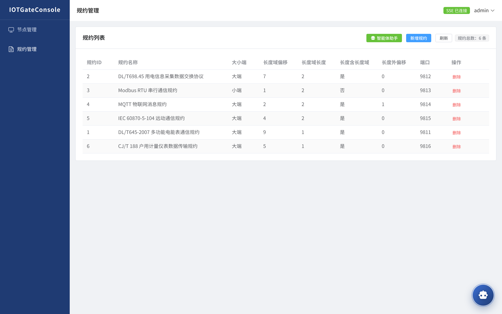

# IOTGateConsole —— IOTGate 智能网关控制台（AI 智能体版）


> IOTGate 智能网关的**管理平台**：实时查看 IOTGate CLUSTER 运行状态，远程执行网关规约解析服务的启动、关闭、重启，以及多规约策略配置；**v2.2 内置 AI 悬浮机器人**，粘贴协议帧结构描述即可自动生成规约配置。

[](https://BrianApple.github.io/docs/iotgate-console/intro)
[](https://gitee.com/willbeahero/IOTGateConsole)

---

## ✨ 核心功能

| 能力 | 说明 |
|---|---|
| **节点监控** | 实时展示网关节点列表（动态注册 + 静态配置），TCP 探测在线状态，SSE 实时推送上下线 |
| **规约远程管理** | 远程开启/关闭/新增/删除网关多规约解析服务，变更实时同步网关 |
| **AI 智能体（v2.2）** | 右下角悬浮机器人：粘贴协议**帧结构描述** → 大模型自动提取长度域、推导拆包/黏包解码参数 → **一键填充**规约表单 |
| **大模型动态配置** | 厂商无关（DeepSeek/通义/GLM/Ollama/OpenAI 等任意 OpenAI 兼容接口），可视化修改、保存即时生效、无需重启 |
| **动态节点发现** | 网关 `-c -r` 主动注册 + 10s 心跳 + 30s 离线判定 + 404 自愈重注册，无需 Zookeeper |
| **Vue3 前端** | 单页应用 + SSE 实时事件推送（节点状态/规约变更） |

## 🎯 项目价值

- **v2.0 架构演进**：去除 Zookeeper 依赖，改为「网关主动注册 + 静态配置兜底」双通道，部署更简单
- **AI 提效**：协议接入从人工解析报文 → AI 自动推导解码参数，接入效率大幅提升
- **技术栈**：JDK 21 + Spring Boot 3.5 + LangChain4j 1.18（AiServices 声明式结构化输出）
- **开箱即用**：MySQL 建表 + 环境变量注入口令 + jar 启动，默认端口 8686

## 📸 截图

| AI 智能体对话解析 | 节点管理（动态注册监控） |
|---|---|
|  |  |

| 大模型配置面板 | 规约管理（多规约策略） |
|---|---|
|  |  |

## 🚀 快速开始

```bash
# 1. 环境：jdk21（Temurin 21 LTS 及以上）、mysql5.5+、IOTGate 节点
# 2. 导入建表脚本
mysql -uroot -p < src/main/resources/strategy.sql

# 3. 数据库口令通过环境变量注入（避免明文入库）
export DB_USERNAME=root
export DB_PASSWORD=你的数据库密码

# 4. 配置 gate.nodes 网关节点列表（application.properties）

# 5. 打包启动（默认端口 8686）
mvn package
java -jar target/iotgate-console.jar

# 6. 访问 http://127.0.0.1:8686/static/index.html （用户名密码随意填写，没有存库）
```

## 📚 详细文档（文档站）

完整教程已迁移至文档站，**后续文档更新以文档站为核心**：

| 文档 | 链接 |
|---|---|
| 产品介绍 | https://BrianApple.github.io/docs/iotgate-console/intro |
| 快速开始 | https://BrianApple.github.io/docs/iotgate-console/quickstart |
| 使用指南 | https://BrianApple.github.io/docs/iotgate-console/guide |

## 📌 版本

- **v2.2（当前）**：悬浮机器人 + 大模型配置动态化 + 节点/规约管理增强（JDK 21 + Spring Boot 3.5 + LangChain4j 1.18）
- **v2.1**：新增智能体模式（AI 解析协议帧结构、自动填充规约表单）
- **v2.0**：去 Zookeeper、Vue3 重构、SSE 实时推送

## 🔗 生态与链接

- **网关本体**：IOTGate —— https://gitee.com/willbeahero/IOTGate
- **GitHub 镜像**：https://github.com/BrianApple/IOTGateConsole
- **开源文档站**：https://BrianApple.github.io （全部产品教程）
- **交流群**：QQ 844082385
